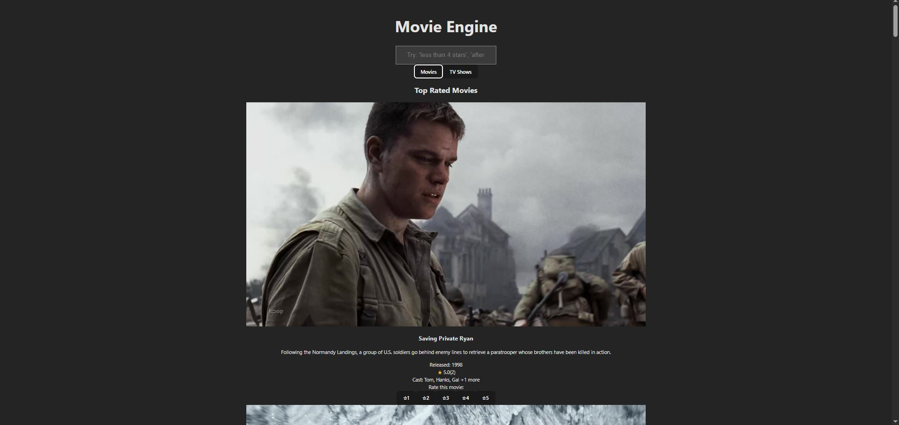
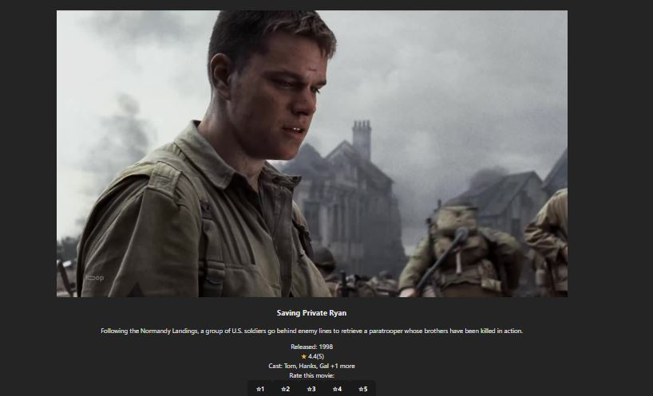

# Tech stack

- React + TS + Vite
- TailwindCSS for responsive layout

# How to start

- Add the backend URL and the api token (same as in the backends .env) into .env file

- run the following command and the app will load in localhost:5173

```bash
$ npm run dev
```

# Example images



- example img of fetching movie data


- example img of search after 1990



- example img of rating a movie and change of the rating avg


# Disclaimer
- env file is pushed simply for the reason of easier dev setup